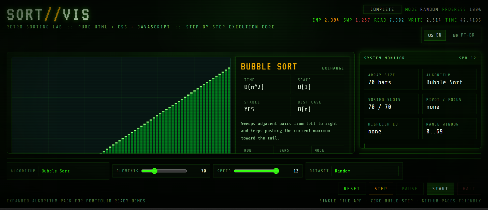
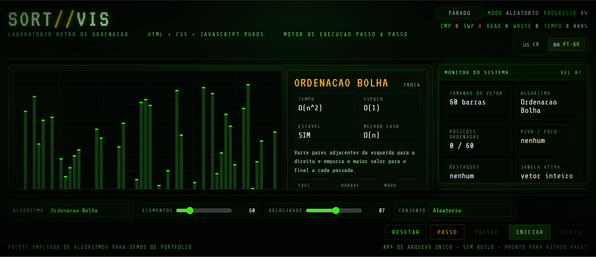

<div align="center">

# 🟢 SORT//VIS

<pre>
+--------------------------------------------------------------+
|              SORT//VIS :: RETRO SORTING LAB                  |
| STATUS  : ONLINE                                             |
| STACK   : HTML / CSS / JAVASCRIPT                            |
| MODE    : ZERO BUILD STEP                                    |
| DISPLAY : CRT-STYLE CANVAS VISUALIZER                        |
| CONTROL : START / PAUSE / STEP / HALT / RESET                |
+--------------------------------------------------------------+
</pre>

### 🧠 Retro sorting visualizer built with Vanilla JS, Canvas and step-by-step execution.


</div>

---

## 🖼️ Preview

<div align="center">



<p><em>🇺🇸 English interface</em></p>

<br/>



<p><em>🇧🇷 Interface em português do Brasil</em></p>

<br/>

<p>
<strong>🌐 Built-in Internationalization (i18n)</strong><br/>
Dynamic language switching with instant UI updates and local persistence.
</p>

</div>

---

## 🧠 Sobre o projeto

SORT//VIS é um laboratório visual de algoritmos de ordenação com estética CRT.

Mais do que animação, ele expõe:

- comparações
- trocas
- leituras/escritas
- tempo de execução
- comportamento interno dos algoritmos

---

## ✨ Destaques

- 🟢 UI estilo terminal CRT
- 🧮 13 algoritmos
- ⏭️ Execução passo a passo
- 📊 Telemetria completa
- 🌐 i18n integrado
- 🧪 Testes automatizados
- ⚡ Zero build

---

## 🌐 Arquitetura de Internacionalização (i18n)

Sistema leve e sem dependências externas.

### Estrutura

```javascript
const I18N = {
  en: {...},
  pt: {...}
}
```

### Troca de idioma

```javascript
function setLocale(locale) {
  currentLocale = locale;
  localStorage.setItem('sortvis-locale', locale);
  updateStaticText();
}
```

### Persistência

```javascript
localStorage.setItem('sortvis-locale', locale);
```

### UI reativa

- Atualização dinâmica via DOM
- Sem reload
- Telemetria sincronizada

### Traduções dinâmicas

```javascript
function localizePhrase(message) {
  // suporte a textos dinâmicos
}
```

### Decisões

- Sem libs externas
- Performance previsível
- Controle total

---

## 🚀 Executar

```bash
npm install
node scripts/ci-check.js
npm run test:e2e
```

ou:

```bash
open index.html
```

---

## 📄 Licença

MIT
