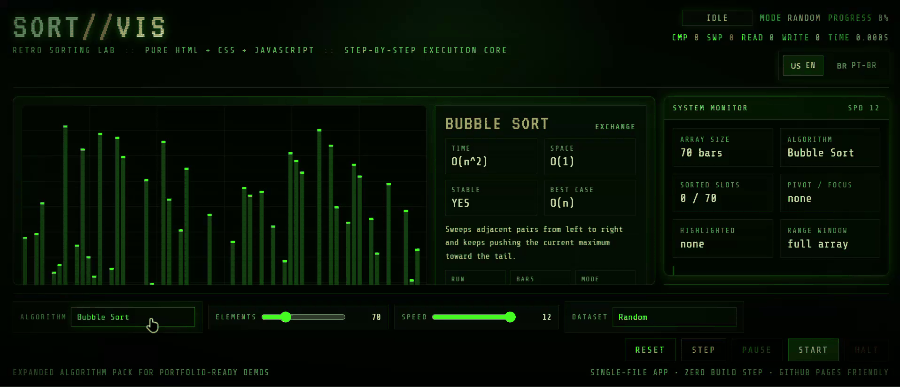

 

# 🟢 SORT//VIS

<pre>
+--------------------------------------------------------------+
|              SORT//VIS :: RETRO SORTING LAB                  |
| STATUS  : ONLINE                                             |
| STACK   : HTML / CSS / JAVASCRIPT                            |
| MODE    : ZERO BUILD STEP                                    |
| DISPLAY : CRT-STYLE CANVAS VISUALIZER                        |
| CONTROL : START / PAUSE / STEP / HALT / RESET                |
+--------------------------------------------------------------+
</pre>

### Visualizador retro de algoritmos de ordenação com JavaScript puro, Canvas e execução passo a passo.

---

## 🎬 Demo

 

<em>▶️ Clique para assistir ao vídeo completo</em>

---

## 🖼️ Preview

  
  

  <em>🇺🇸 English</em> • <em>🇧🇷 Português (Brasil)</em>

